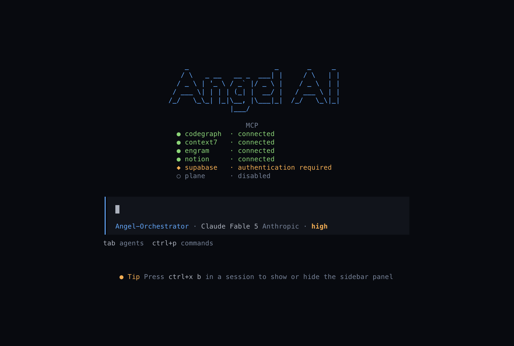
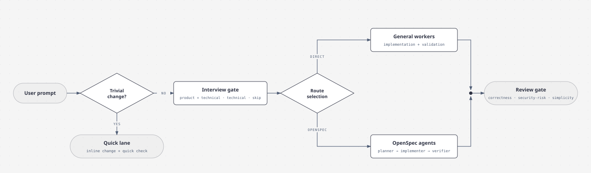

## Installation

The initial distribution supports **macOS on Apple Silicon** only
(`Darwin/arm64`). It does not require Go or cloning this repository. Install the
latest stable version with:

```sh
curl --proto '=https' --tlsv1.2 -fsSL https://raw.githubusercontent.com/Angel-M-R/angel-ai-opencode/main/install.sh | /bin/sh
```

The installer verifies the download and places the executable in
`~/.local/bin/angel-ai`.

```sh
angel-ai                       # opens the interactive wizard
angel-ai version               # shows the installed version without network access
angel-ai update                # forces an update check
```

## Harness Design comparison

The comparison brings together tables and explanations covering agents,
planning, specs and more

Because every OpenCode subagent can run on its own model, the harness can mix
them by role: a highly capable model as the orchestrator, cheaper models as the
executor workers, and a different model again for the reviewers. The wizard's
agent-models step configures this per-agent selection.

**[Read the full design comparison](docs/harness-comparison.md)**

## Orchestrator workflow

The [`angel-orchestrator`](assets/agents/angel-orchestrator.md) agent is a thin
coordinator: it interviews the user, builds a confirmed Brief, routes the work
through Direct workers or the OpenSpec workflow, and closes with an optional
review gate.

<picture>
  <source media="(prefers-color-scheme: dark)" srcset="docs/diagrams/orchestrator-workflow-dark.svg">
  
</picture>

## What it does

Angel AI creates or updates the selected files under `~/.config/opencode/`.
When a managed file already exists and its contents change, the installer first
creates a timestamped backup. Agent, skill, theme, and plugin assets are updated
file by file, so files not managed by Angel AI remain untouched. `AGENTS.md` is
the only full replacement; `opencode.json` and `tui.json` are merged with the
existing configuration.

| File modified | What it is |
|---|---|
| **Agents config** | |
| `~/.config/opencode/agents/*.md` | Selected [agent definitions](assets/agents/) are created or replaced. Each file contains YAML frontmatter and a system prompt. |
| `~/.config/opencode/skills/<skill>/**` | Selected [skills](assets/skills/) are updated recursively. Additional files already present in the destination are preserved. |
| `~/.config/opencode/AGENTS.md` | The existing file is fully replaced with the [global Angel AI rules](assets/agents-md/AGENTS.md), plus the [CodeGraph guidance](assets/integrations/codegraph/AGENTS.md) when selected. |
| **TUI config** | |
| `~/.config/opencode/plugins/cmux-*.js` | The [cmux session and feed plugins](assets/integrations/cmux/) are created or replaced when the cmux integration is selected. |
| `~/.config/opencode/themes/*.json` | Selected [themes](assets/themes/) are created or replaced. |
| `~/.config/opencode/tui-plugins/*` | The selected [Angel AI TUI plugins](assets/tui-plugins/) are created or replaced. |
| `~/.config/opencode/opencode.json` | The [MCP](assets/fragments/mcp.json), [permission](assets/fragments/permissions.json), and [settings](assets/fragments/settings.json) fragments are deep-merged into the existing configuration. Selected agent models, CodeGraph, and tsgo settings are also reconciled without removing unrelated keys. |

## Extras

The last wizard step offers standalone integrations and UI toggles.

- **[CodeGraph](https://github.com/colbymchenry/codegraph)** — installs the
  CLI, registers the local MCP server, and appends its guidance to `AGENTS.md`.
- **[OpenSpec](https://github.com/Fission-AI/OpenSpec)** — installs or updates
  the official OpenSpec CLI.
- **[tsgo](https://github.com/microsoft/typescript-go)** — installs or updates
  tsgo and configures it as the TypeScript LSP.
- **[Angel AI logo](assets/tui-plugins/)** — custom ASCII logo plus MCP status
  in the TUI footer.
- **[one-dark-pro theme](assets/themes/one-dark-pro.json)** — sets one-dark-pro
  as the TUI theme (`tui.json`).
- **[Subagent statusline](https://github.com/Joaquinvesapa/sub-agent-statusline)**
  — third-party npm plugin showing worker activity in the sidebar.
- **[Open in App](https://github.com/Angel-M-R/opencode-open-in-app)** — npm
  plugin that opens files and resources in their native applications.
- **[OpenSpec task TUI](https://github.com/Angel-M-R/opencode-openspec-task-tui)**
  — npm plugin showing OpenSpec task progress in the sidebar.
- **[cmux](https://cmux.com)** — cmux notifications and Feed for OpenCode
  sessions.

## Usage from the repository

```sh
go run .                  # opens the wizard
go run . --all            # installs everything without the TUI
go run . --all --dry-run  # shows the plan without changing anything
go run . --target /path   # installs in another directory (for testing)
```
