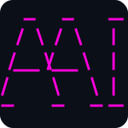
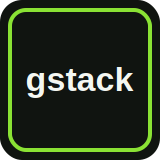
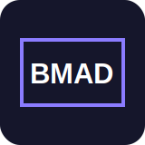

# Comparativa de diseño

[Volver al README](../README.md)

Existen muchos harnesses y metodologías para agentes de código. Comparo estos
siete porque cubren enfoques que me interesan, aunque no todos posean las mismas
capas: Superpowers, por ejemplo, hereda varias capacidades del harness. No es un
benchmark ni pretende declarar un ganador; resume diferencias de diseño.

| [Gentle AI](https://github.com/Gentleman-Programming/gentle-ai) | [Angel AI](https://github.com/Angel-M-R/angel-ai-opencode) | [Oh My Pi](https://github.com/can1357/oh-my-pi) | [gstack](https://github.com/garrytan/gstack) | [ECC](https://github.com/affaan-m/ECC) | [Superpowers](https://github.com/obra/superpowers) | [BMAD Method](https://github.com/bmad-code-org/BMAD-METHOD) |
|:---:|:---:|:---:|:---:|:---:|:---:|:---:|
|  |  |  |  |  |  |  |

## Agentes

| Gentle AI | Angel AI | Oh My Pi | gstack | ECC | Superpowers | BMAD Method |
|---|---|---|---|---|---|---|
| 18 subagentes fijos + 1 orquestador | 6 subagentes fijos + 1 orquestador | 6 agentes fijos + `advisor` | 23 especialistas como skills/roles; sin roster fijo | 67 subagentes fijos + comandos multiagente | Subagentes dinámicos del harness; sin roster propio | 6 agentes documentados (12+ según su README); Party Mode combina personas |

En mi experiencia actual, los modelos más capaces, una buena compactación y el
mejor aprovechamiento del contexto reducen la necesidad de dividir el trabajo
entre muchos agentes. También importa qué se cuenta: un agente fijo, un rol
dinámico y una persona interna de una skill tienen costes de coordinación
distintos.

## Planificación y entrevistas

| Gentle AI | Angel AI | Oh My Pi | gstack | ECC | Superpowers | BMAD Method |
|---|---|---|---|---|---|---|
| Sin entrevista integrada | Entrevista opcional, técnica y/o de producto | Sin entrevista integrada | `/office-hours` + revisiones de plan con `/autoplan` | `/plan` y multiplan; sin entrevista integrada evidenciada | Brainstorming socrático obligatorio antes del plan | Brainstorming y PRD guiados; profundidad adaptable |

Hoy prefiero poder entrevistar antes de planificar cuando el problema todavía
está borroso, sin imponer ese paso a tareas directas. Angel AI toma ideas de
[`grill-me`](https://github.com/mattpocock/skills) y
[`gstack`](https://github.com/garrytan/gstack) para cuestionar requisitos de
producto y decisiones técnicas antes de escribir el plan. gstack y BMAD también
facilitan esa exploración; Superpowers la convierte en parte obligatoria de su
metodología, mientras ECC se centra en planificar y orquestar.

## Memoria

| Gentle AI | Angel AI | Oh My Pi | gstack | ECC | Superpowers | BMAD Method |
|---|---|---|---|---|---|---|
| Engram: memoria semántica | Sin memoria integrada | Hindsight: memoria semántica | `/learn`: patrones; GBrain semántico opcional | Estado persistente de sesiones, skills aprendidas y métricas | Documentos de diseño/plan; memoria heredada del harness | `.memlog.md` + `project-context.md`; no semántica |

Sigo probando alternativas. No equiparo búsqueda semántica, estado persistente y
documentos: resuelven problemas distintos. En cualquier caso, si el contexto
conservado es pobre, incompleto o caduco, puede desviar al agente y resultar peor
que no tener memoria.

## Specs

| Gentle AI | Angel AI | Oh My Pi | gstack | ECC | Superpowers | BMAD Method |
|---|---|---|---|---|---|---|
| SDD propio con Engram, OpenSpec o ambos | OpenSpec oficial | Sistema propio | `/spec`: 5 fases, quality gate y archivo | Planes y guías; sin ciclo de specs dedicado | Diseño aprobado + plan de implementación detallado | PRD, arquitectura, stories, readiness y validación |

Llevo tiempo trabajando con specs y mi criterio actual es dividir PRDs, ADRs y
features en tareas pequeñas y verificables. Elijo OpenSpec para el flujo
estructurado, aunque skills como
[`/prototype`](https://github.com/mattpocock/skills/tree/main/skills/engineering/prototype)
o [`/to-spec`](https://github.com/mattpocock/skills/tree/main/skills/engineering/to-spec)
pueden producir una spec Markdown directa cuando basta con algo más ligero.

## Ahorro de tokens y modelos

| Gentle AI | Angel AI | Oh My Pi | gstack | ECC | Superpowers | BMAD Method |
|---|---|---|---|---|---|---|
| Sin optimizador específico | Sin optimizador específico | Hashline: −61 % de tokens de salida con Grok 4 Fast | Routing en navegador + benchmark de tokens/coste; sin ahorro general declarado | Routing, compactación estratégica y skills de coste; sin porcentaje general | Heredado del harness; no aplica a la metodología | Web bundles con suscripción plana; sin optimizador dinámico evidenciado |

Valoro reducir reintentos y resultados inútiles, pero soy escéptico ante los
ahorradores que prometen recortes drásticos simplemente delegando en un modelo
más barato: gastar menos tokens no compensa perder precisión o repetir trabajo.
Routing, compactación, presupuestos y porcentajes medidos son mecanismos
distintos y conviene presentarlos como tales.

## Review final

| Gentle AI | Angel AI | Oh My Pi | gstack | ECC | Superpowers | BMAD Method |
|---|---|---|---|---|---|---|
| Obligatoria; 1 lente o 4R según el riesgo | Opcional; hasta 3 revisores elegidos | Opcional; entre 1 y 16 revisores según el cambio | `/review`, QA y `/ship`; `/codex` opcional | Review y quality gates disponibles; no gate final universal | Dos reviews por tarea + verificación de rama | Review adversarial en capas; no invocación universal |

Mi preferencia actual es que la revisión sea proporcional al riesgo. Gentle AI
la convierte en una puerta obligatoria y reserva sus cuatro revisores 4R para
cambios sensibles o grandes; Angel AI deja elegir hasta tres perspectivas; Oh
My Pi ajusta automáticamente el paralelismo de `/review` al tamaño del diff.
gstack encadena varias comprobaciones de cierre, ECC y BMAD las ofrecen como
flujos invocables y Superpowers integra revisión por tarea en su método.

## MCPs

| Gentle AI | Angel AI | Oh My Pi | gstack | ECC | Superpowers | BMAD Method |
|---|---|---|---|---|---|---|
| 3 incluidos | 2 incluidos | Sin MCPs propios; descubre los del disco | GBrain opcional; sin suite fija | Configuraciones de ejemplo; sin conteo fijo | Heredados del harness; no aplica | No incluye MCPs |

Para mí, el número de MCPs no mide por sí solo la calidad del harness. Prefiero
un conjunto pequeño y deliberado: cada servidor debe aportar una capacidad útil
sin inflar el catálogo de herramientas ni distraer al modelo. Que una metodología
portable herede los MCPs del harness es un límite de responsabilidad, no una
carencia.
