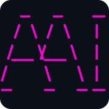

# Design comparison

[Back to the README](../README.md)

There are many harnesses and methodologies for coding agents. I compare these
eight because they cover approaches that interest me, although they do not all
cover the same layers themselves: Superpowers, for example, inherits several
capabilities from the harness. This is not a benchmark and does not attempt to
declare a winner; it summarizes design differences.

| [Angel AI](https://github.com/Angel-M-R/angel-ai-opencode) | [Gentle AI](https://github.com/Gentleman-Programming/gentle-ai) | [Oh My Pi](https://github.com/can1357/oh-my-pi) | [gstack](https://github.com/garrytan/gstack) | [ECC](https://github.com/affaan-m/ECC) | [Superpowers](https://github.com/obra/superpowers) | [BMAD Method](https://github.com/bmad-code-org/BMAD-METHOD) | [Oh My OpenAgent](https://github.com/code-yeongyu/oh-my-openagent) |
|:---:|:---:|:---:|:---:|:---:|:---:|:---:|:---:|
|  |  |  |  |  |  |  |  |

## Agents

| Angel AI | Gentle AI | Oh My Pi | gstack | ECC | Superpowers | BMAD Method | Oh My OpenAgent |
|---|---|---|---|---|---|---|---|
| 6 fixed subagents + 1 orchestrator | 18 fixed subagents + 1 orchestrator | 6 fixed agents + `advisor` | 23 specialists as skills/roles; no fixed roster | 67 fixed subagents + multi-agent commands | Dynamic harness subagents; no owned roster | 6 documented agents (12+ according to its README); Party Mode combines personas | [11 Ultimate agents](https://github.com/code-yeongyu/oh-my-openagent/blob/32d5a4e31746cf936e238ef31ea2cea53d5f02ac/docs/reference/features.md#agents); [optional Team Mode: lead + up to 8 members](https://github.com/code-yeongyu/oh-my-openagent/blob/32d5a4e31746cf936e238ef31ea2cea53d5f02ac/docs/reference/features.md#team-mode-experimental-off-by-default) |

In my current experience, more capable models, good compaction, and better use
of context reduce the need to divide work among many agents. What is being
counted also matters: a fixed agent, a dynamic role, and a persona embedded in a
skill have different coordination costs.

## Planning and interviews

| Angel AI | Gentle AI | Oh My Pi | gstack | ECC | Superpowers | BMAD Method | Oh My OpenAgent |
|---|---|---|---|---|---|---|---|
| Optional technical and/or product interview | No built-in interview | No built-in interview | `/office-hours` + plan reviews with `/autoplan` | `/plan` and multi-plan; no built-in interview evidenced | Mandatory Socratic brainstorming before planning | Guided brainstorming and PRDs; adaptable depth | [Prometheus interview with optional dual review](https://github.com/code-yeongyu/oh-my-openagent/blob/32d5a4e31746cf936e238ef31ea2cea53d5f02ac/docs/guide/orchestration.md#planning-prometheus--metis--momus--oracle); [optional `/hyperplan`](https://github.com/code-yeongyu/oh-my-openagent/blob/32d5a4e31746cf936e238ef31ea2cea53d5f02ac/docs/reference/features.md#commands) |

I currently prefer having the option to interview before planning when the
problem is still unclear, without imposing that step on straightforward tasks.
Angel AI draws ideas from
[`grill-me`](https://github.com/mattpocock/skills) and
[`gstack`](https://github.com/garrytan/gstack) to challenge product requirements
and technical decisions before writing the plan. gstack, BMAD, and Oh My
OpenAgent's Prometheus also facilitate this exploration; Superpowers makes it a
mandatory part of its methodology, while ECC focuses on planning and
orchestration.

## Memory

| Angel AI | Gentle AI | Oh My Pi | gstack | ECC | Superpowers | BMAD Method | Oh My OpenAgent |
|---|---|---|---|---|---|---|---|
| No built-in memory | Engram: semantic memory | Hindsight: semantic memory | `/learn`: patterns; optional GBrain semantic memory | Persistent session state, learned skills, and metrics | Design/plan documents; memory inherited from the harness | `.memlog.md` + `project-context.md`; not semantic memory | [Git-backed per-agent memory with reflection and search; on by default](https://github.com/code-yeongyu/oh-my-openagent/blob/32d5a4e31746cf936e238ef31ea2cea53d5f02ac/docs/reference/configuration.md#memory) |

I am still testing alternatives. I do not consider semantic search, persistent
state, and documents equivalent: they solve different problems. In any case, if
the retained context is poor, incomplete, or stale, it can mislead the agent and
be worse than having no memory.

## Specs

| Angel AI | Gentle AI | Oh My Pi | gstack | ECC | Superpowers | BMAD Method | Oh My OpenAgent |
|---|---|---|---|---|---|---|---|
| Official OpenSpec | Custom SDD with Engram, OpenSpec, or both | Custom system | `/spec`: 5 phases, quality gate, and archive | Plans and guides; no dedicated spec lifecycle | Approved design + detailed implementation plan | PRD, architecture, stories, readiness, and validation | [Interviewed Markdown plans in `.omo/plans` + boulder-tracked execution](https://github.com/code-yeongyu/oh-my-openagent/blob/32d5a4e31746cf936e238ef31ea2cea53d5f02ac/docs/guide/orchestration.md#start-work-behavior-and-session-continuity) |
https://github.com/scion-frontiers/farmtable
I have been working with specs for some time, and my current approach is to split
PRDs, ADRs, and features into small, verifiable tasks. I choose OpenSpec for the
structured workflow, although skills such as
[`/prototype`](https://github.com/mattpocock/skills/tree/main/skills/engineering/prototype)
or [`/to-spec`](https://github.com/mattpocock/skills/tree/main/skills/engineering/to-spec)
can produce a direct Markdown spec when something lighter is sufficient.

## Token savings and models

| Angel AI | Gentle AI | Oh My Pi | gstack | ECC | Superpowers | BMAD Method | Oh My OpenAgent |
|---|---|---|---|---|---|---|---|
| No specific optimizer | No specific optimizer | Hashline: 61% fewer output tokens with Grok 4 Fast | Browser routing + token/cost benchmark; no general savings claim | Routing, strategic compaction, and cost-aware skills; no general percentage | Inherited from the harness; not applicable to the methodology | Web bundles with flat-rate subscriptions; no evidenced dynamic optimizer | [Category/model routing](https://github.com/code-yeongyu/oh-my-openagent/blob/32d5a4e31746cf936e238ef31ea2cea53d5f02ac/docs/reference/features.md#category-system), [preemptive compaction, and output truncation](https://github.com/code-yeongyu/oh-my-openagent/blob/32d5a4e31746cf936e238ef31ea2cea53d5f02ac/docs/reference/features.md#truncation--context-management); no general percentage |

I value reducing retries and useless results, but I am skeptical of optimizers
that promise drastic cuts simply by delegating to a cheaper model: spending
fewer tokens does not make up for lost accuracy or repeated work. Routing,
compaction, budgets, and measured percentages are different mechanisms and
should be presented as such.

## Final review

| Angel AI | Gentle AI | Oh My Pi | gstack | ECC | Superpowers | BMAD Method | Oh My OpenAgent |
|---|---|---|---|---|---|---|---|
| Optional; up to 3 selected reviewers | Mandatory; 1 lens or 4R depending on risk | Optional; between 1 and 16 reviewers depending on the change | `/review`, QA, and `/ship`; optional `/codex` | Review and quality gates available; no universal final gate | Two reviews per task + branch verification | Layered adversarial review; no universal invocation | [`review-work`: 5 parallel lenses; required before PR handoff or on explicit request](https://github.com/code-yeongyu/oh-my-openagent/blob/32d5a4e31746cf936e238ef31ea2cea53d5f02ac/packages/shared-skills/skills/review-work/SKILL.md#review-work---5-agent-parallel-review-orchestrator) |

My current preference is for review to be proportional to risk. Gentle AI makes
it a mandatory gate and reserves its four 4R reviewers for sensitive or large
changes; Angel AI lets users choose up to three perspectives; Oh My Pi
automatically adjusts `/review` parallelism to the size of the diff. Oh My
OpenAgent runs five parallel lenses before PR handoff or when explicitly
requested. gstack chains several closing checks, ECC and BMAD offer them as
invocable workflows, and Superpowers integrates per-task review into its
method.

## MCPs

| Angel AI | Gentle AI | Oh My Pi | gstack | ECC | Superpowers | BMAD Method | Oh My OpenAgent |
|---|---|---|---|---|---|---|---|
| 2 included | 3 included | No MCPs of its own; discovers them from disk | Optional GBrain; no fixed suite | Example configurations; no fixed count | Inherited from the harness; not applicable | Does not include MCPs | [5 built-in + `.mcp.json` and skill-embedded tiers](https://github.com/code-yeongyu/oh-my-openagent/blob/32d5a4e31746cf936e238ef31ea2cea53d5f02ac/docs/reference/features.md#mcps) |

For me, the number of MCPs does not measure harness quality on its own. I prefer
a small, deliberate set: each server should provide a useful capability without
inflating the tool catalog or distracting the model. A portable methodology
inheriting MCPs from the harness is a responsibility boundary, not a shortcoming.
